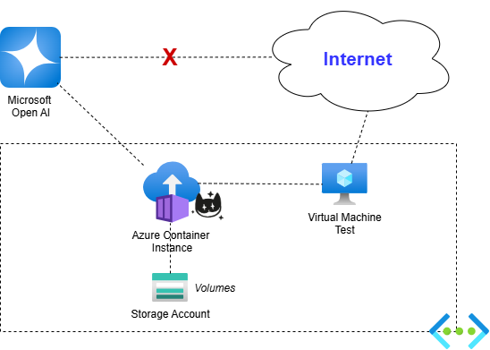

# Cheshire Cat AI and Integration with Azure Container Instance
Many people know me and are aware of my strong support for Piero Savastano. This is not only because I firmly believe in his project, but also because I consider it a prime example of excellence in the tech sector, designed with great care and expertise.

[Cheshire Cat AI Website](https://cheshirecat.ai/)

However, even the most well-crafted projects can encounter challenges, particularly when it comes to enterprise scalability and cloud security. These are real obstacles that require practical solutions to ensure our work can thrive and adapt to the demands of the modern business environment.

To address these issues, I have developed a series of scripts aimed at enhancing infrastructure security. The goal is to make installing Docker containers on Azure not only accessible but also more secure, even for beginners. These tools enable you to seamlessly integrate your containers into a robust and secure Azure infrastructure.

It is important to note that this process is not without its difficulties, especially considering that Azure and Microsoft do not provide direct assistance in this area, except through highly customized scripts. However, you will find all the necessary resources in this repository. Your collaboration is vital, and I am more than open to receiving suggestions for further improving procedures and the overall architecture.

I wish everyone good luck and a constructive experience in implementing these solutions.

## Architecture Description

The goal of this project is to ensure a secure and controlled environment for interactions between AI services and enterprise resources. Specifically, we aim to expose the APIs of the Microsoft OpenAI service solely within the Azure Virtual Network (VNet), ensuring that the Docker container for Cheshire Cat AI operates exclusively within the same VNet. This approach guarantees that communications are protected from unauthorized access, restricting interactions to the defined boundaries of the virtual network.

The currently deployed virtual machine serves as a practical demonstration, showcasing that the system is accessible only within the network. However, this configuration can be further optimized in future stages. The virtual machine could be removed in favor of segmenting the VNet and connecting it through a dedicated VPN for secure links with other networks. Alternatively, a Gateway service could be developed via a WebApp to allow secure communication from the system to the outside.

Moreover, for those seeking an even more sophisticated level of API management and security, there is the option to integrate Azure API Management. This highly reliable service allows not only for the orchestration and protection of APIs but also for efficiently monitoring and scaling them. By using Azure API Management, you can build an architecture that ensures security and performance while offering detailed control over how APIs are accessed and used.

In summary, our flexible and forward-looking approach provides a structure that can evolve according to future needs, always ensuring the highest level of security and operability.
