# Configurazione iniziale dell'ambiente

Benvenuti all’avventura nell’ecosistema Azure! Prima di immergerci nei dettagli della configurazione tecnica, assicuriamoci di avere tutto ciò di cui abbiamo bisogno. È essenziale avere un tenant di Azure attivo con del credito disponibile. Buone notizie per chi ama sperimentare: Microsoft offre a tutti i nuovi utenti un credito gratuito di 200€ per il primo mese! Questo vi permetterà di esplorare liberamente senza preoccuparvi troppo dei costi, dato che le risorse utilizzate in questa guida sono di solito abbastanza economiche. Pensate a questo come al nostro biglietto d'ingresso nel magico mondo di Azure.

## Creiamo il Virtual Network

La prima missione? Organizzare le vostre risorse con un Resource Group. Immaginate questo come un cassetto dedicato all’interno del vostro armadio virtuale, per tenere le cose ordinate e accessibili. Ecco come appare il nostro Resource Group:

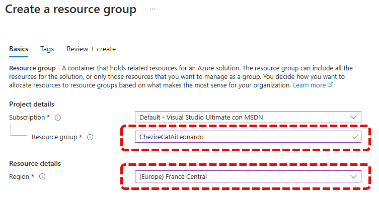

Ora è il momento di progettare la vostra autostrada digitale: la Virtual Network. Questa sarà la via di comunicazione per le vostre future risorse, quindi scegliete con attenzione.

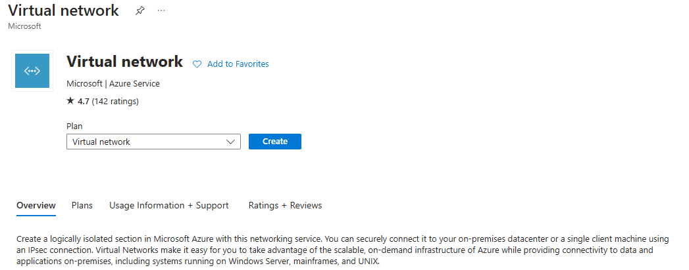

La vostra Virtual Network ha bisogno di un nome unico e distintivo, qualcosa che rispecchi la vostra identità digitale. Nel mio esempio l'ho chiamata "vnetccaileonardo", ma voi potete scegliere il nome che più vi si addice.

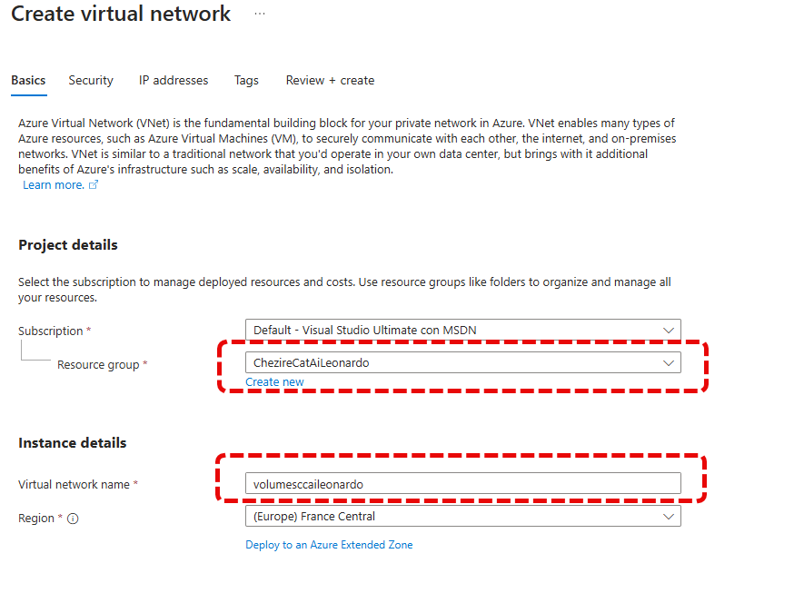

Ora, fate attenzione a impostare correttamente la classe degli indirizzi IP. È cruciale evitare sovrapposizioni con la rete interna per una futura connessione VPN impeccabile.

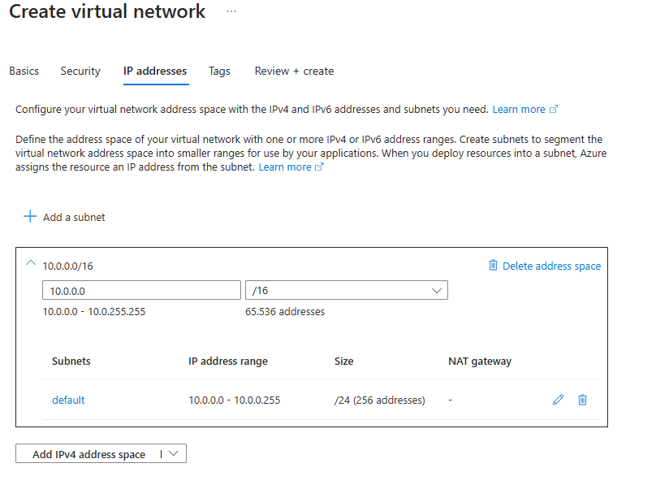

Per ottimizzare il flusso di dati, abilitate gli endpoint della vostra rete virtuale per servizi vitali come lo storage. Se all’inizio ne attivate troppi, niente paura! Potrete sempre ridurli in base alle esigenze.

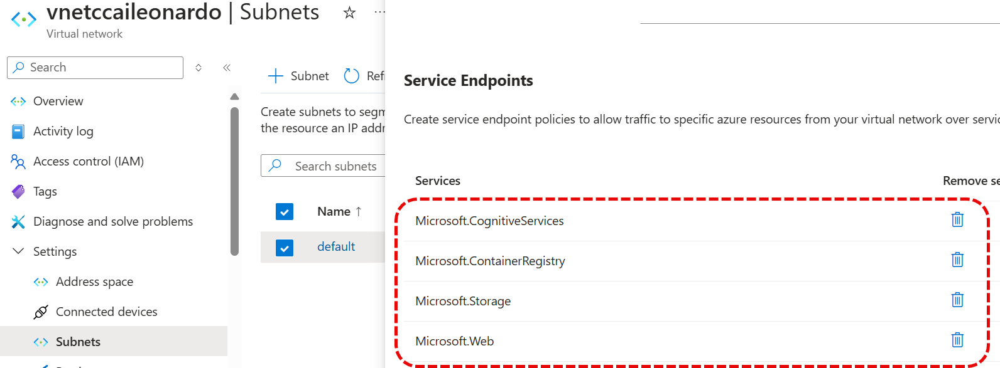

## Creiamo Open AI

Passiamo alla parte più intrigante: l’integrazione con OpenAI. Abbiamo deciso di localizzare il nostro servizio in Francia, creando così una connessione esclusiva tra il servizio AI e la nostra Virtual Network, mantenendo il massimo riserbo sulle vostre informazioni.

Per cui selezioniamo il servizio Open AI

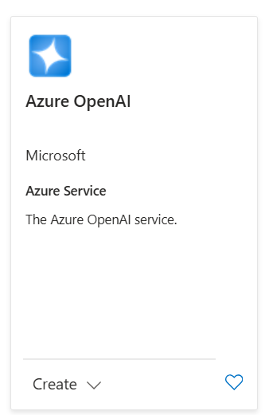

Assicuratevi di aver selezionato correttamente il Resource Group e scegliete un nome evocativo per il vostro nuovo servizio.

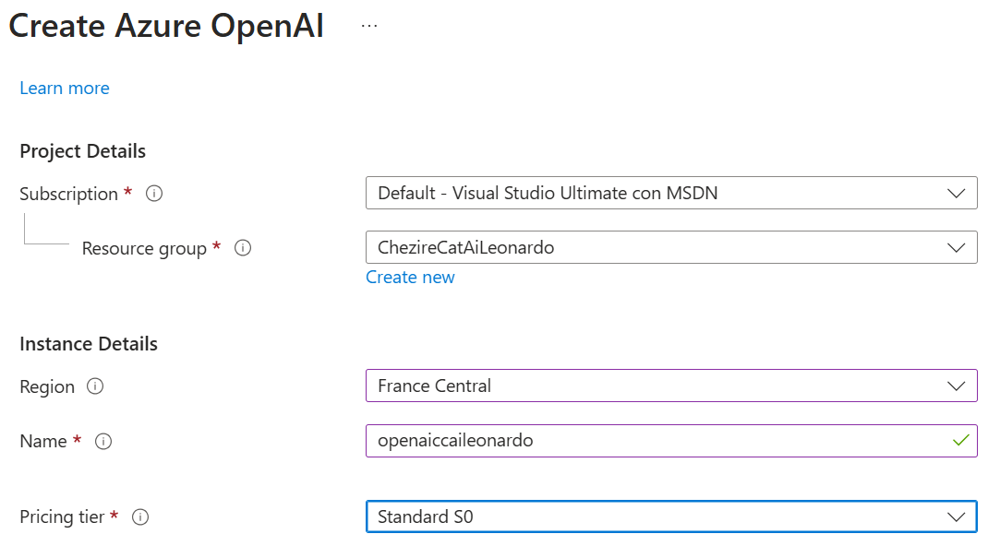

Garantite che l’accesso sia limitato alla VNet selezionata, proteggendo così il vostro ecosistema di dati.

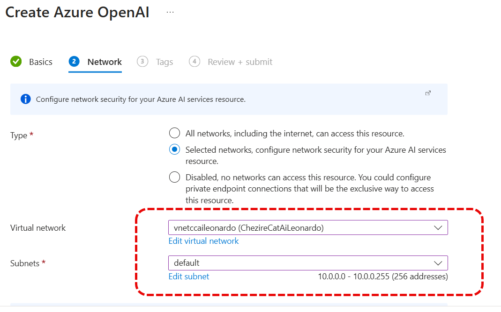

Infine, impostate la distribuzione del vostro modello AI, un passo cruciale per configurare il nostro progetto finale, Cheshire Cat AI.

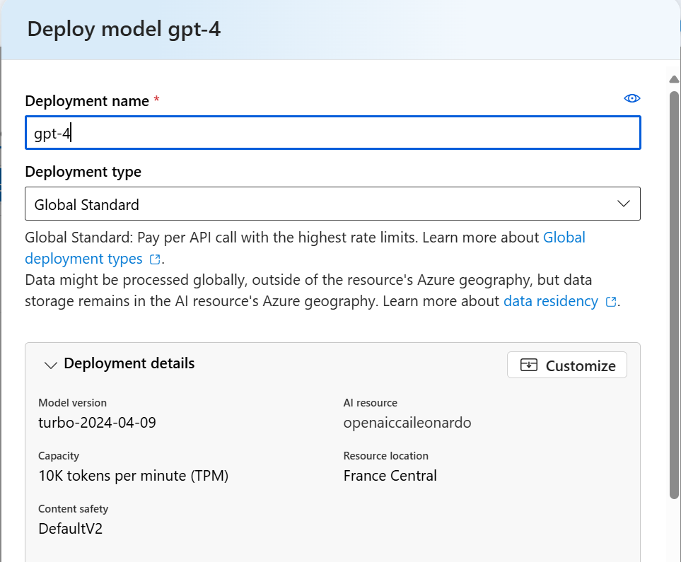

Non dimenticate di prendere nota delle chiavi necessarie per l’integrazione:

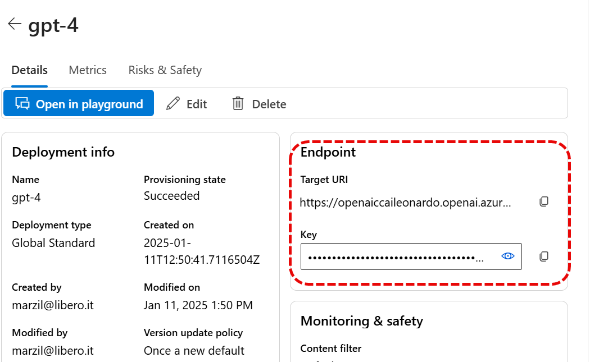 

## Creaimo lo Storage Account

Per concludere, ci occupiamo del cuore del nostro ambiente virtuale: lo Storage Account. Sarà l’habitat dei dischi Docker, che Cheshire Cat utilizzerà con maestria per compiere le sue magie.

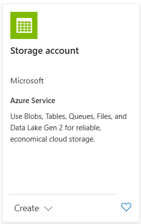

Infine, determinate la ridondanza desiderata per la vostra configurazione di storage, scegliendo il livello di resilienza che meglio risponde alle vostre esigenze.

Ed ora la rete, in modo tale che questo sia accessibile solo all'interno della vnet che abbiamo precedentemente creato.

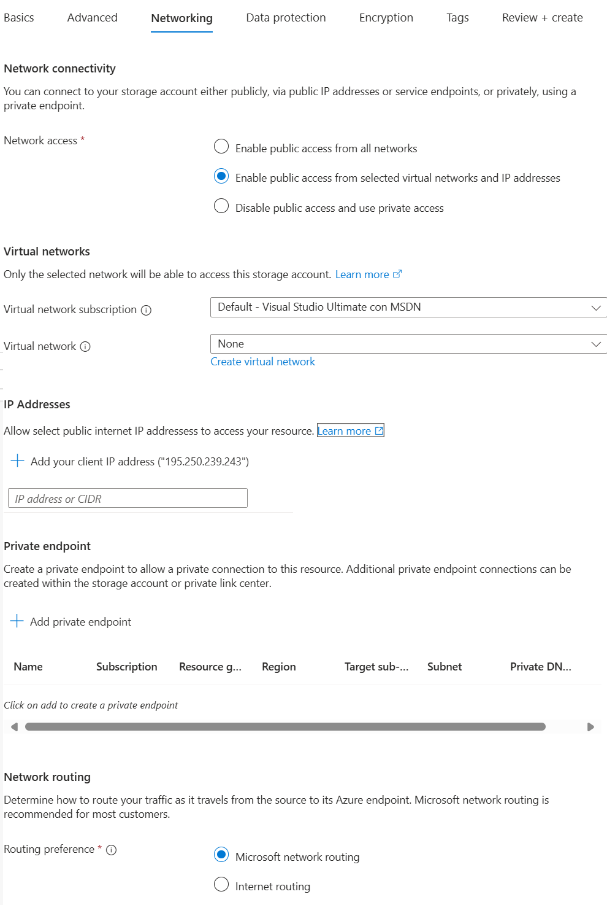

Ed ora per verificare create pure una macchina virtuale all'interno della rete per vedere che a queste risorse potete accedere solo dall'interno della rete stessa.

Ecco fatto! Ora siete pronti per continuare la vostra esplorazione e sperimentazione in Azure, un viaggio che promette di essere entusiasmante e pieno di scoperte. Buon divertimento!

