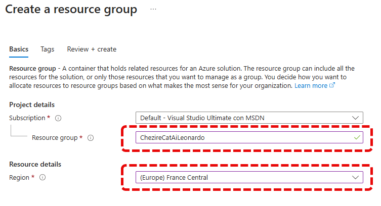
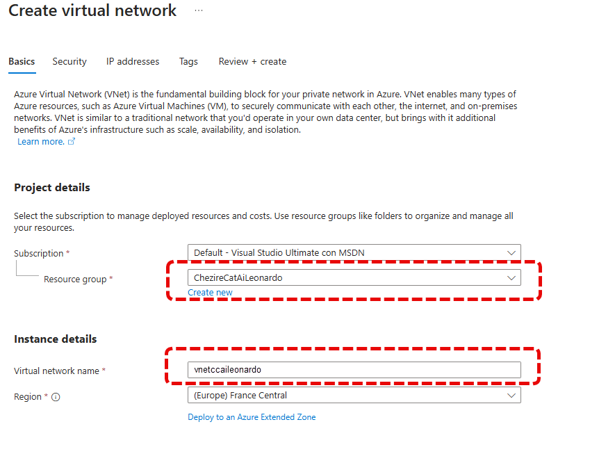
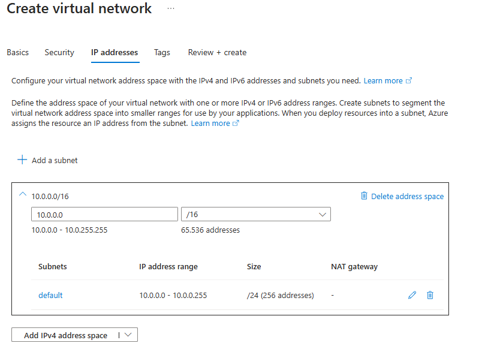
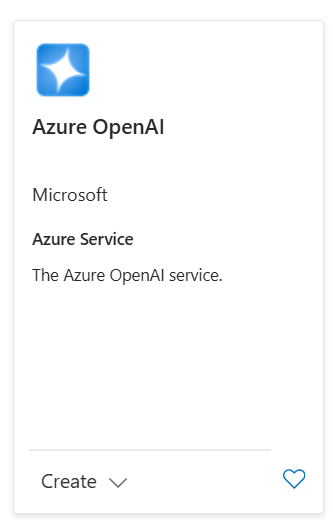

# Initial Environment Setup

Welcome to the adventure in the Azure ecosystem! Before diving into the technical configuration details, let's ensure we have everything we need. It's essential to have an active Azure tenant with available credit. Good news for those who love to experiment: Microsoft offers all new users a free €200 credit for the first month! This will allow you to explore freely without worrying too much about costs, as the resources used in this guide are typically quite affordable. Think of this as your ticket to the magical world of Azure.

## Create the Virtual Network

The first mission? Organize your resources with a Resource Group. Imagine this as a dedicated drawer in your virtual closet, keeping things neat and accessible. Here's how our Resource Group appears:

Now it's time to design your digital highway: the Virtual Network. This will be the communication path for your future resources, so choose wisely.

Your Virtual Network needs a unique and distinctive name, something that reflects your digital identity. In my example, I named it "vnetccaileonardo," but you can choose a name that best suits you.

Now, be careful to correctly set the IP address range. It's crucial to avoid overlaps with your internal network for a future seamless VPN connection.

To optimize data flow, enable the endpoints of your virtual network for vital services such as storage. If you activate too many at first, don't worry! You can always reduce them as needed.

## Create Open AI

Let's move on to the most intriguing part: integrating with OpenAI. We have decided to locate our service in France, thus creating an exclusive connection between the AI service and our Virtual Network, maintaining the utmost confidentiality of your information.

So let's select the Open AI service:

Ensure you have correctly selected the Resource Group and choose an evocative name for your new service.

Ensure that access is restricted to the selected VNet, thus safeguarding your data ecosystem.

Finally, configure the deployment of your AI model, a crucial step for setting up our final project, Cheshire Cat AI.

Don't forget to take note of the keys necessary for integration:

## Create the Storage Account
To conclude, let's focus on the heart of our virtual environment: the Storage Account. This will be the habitat of the Docker disks, which Cheshire Cat will skillfully use to perform its magic.

Finally, determine the desired redundancy for your storage configuration, choosing the level of resilience that best meets your needs.

And now the network, so that this is accessible only within the previously created vnet.

Now, to verify, create a virtual machine within the network to ensure that these resources can only be accessed from within the network itself.

And there you have it! You are now ready to continue your exploration and experimentation in Azure, a journey that promises to be exciting and full of discoveries. Have fun!

