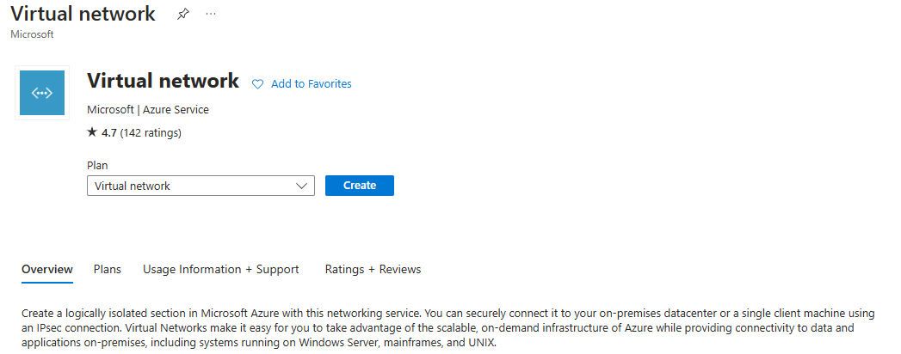
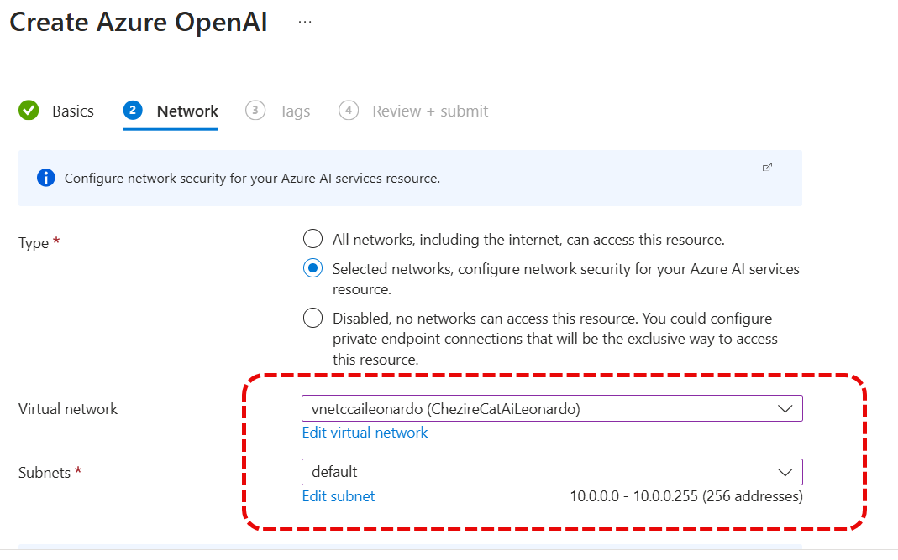
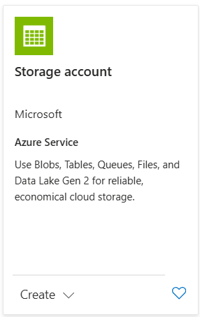

# Configurazione iniziale dell'ambiente

Ovviamente per poter iniziare dobbiamo avere un tenat di Azure con del credito attivo. Non disperate perche' Microsoft vi permette di avere 200€ di credito gratuito il primo mese per fare delle prove e poi le risorse che vengono utilizzate e che utilizzeremo durante questo esempio non hanno costi altissimi. Magari in un atro Markdown vi riporto i costi corretti ad oggi.

## Creiamo il Virtual Network

Prima operazione è quella di creare un Resource Group con il solo scopo di separare le risorse

Adesso creaimo la nostra Virtual Network.

Adesso scegliete il nome piu' adatto alla vostra vnet. Nel mio caso ho inserito vnetccaileonardo, ma voi sceglietene uno vostro.

Infine scegliete la classe di indirizzi IP per agganciarvi. Mi raccomendo non scegliete una classe di IP in overlap con la vostra rete interna perchè nel caso deideriate agganciarvi tramite una VPN questo non permetterà di connettervi.

Adesso abilitate gli enpoint della vnet per lo storage account e gli altri servizi indispensabili.

Forse ne ho messo qualcuno in piu' del necessario, ma con calma potrete ridurli al necessario.

## Creiamo Open AI

Per or abbiamo creato OpenAI in francia perchè è li che abbiamo creato anche la vnet e desidero che il servizio di open ai non sia accessibile da qualsiasi parte ma solo dalle risorse all'interno della mia vnet.

Per cui selezioniamo il servizio Open AI

A questo punto inseriamo il resource group corretto ed il nome per il nostro servizio.

Poi selezioniamo come accesso la Vnet corretta

Ed infine creiamo una distribuzione del nostro modello che poi ci servirà per configurare Cheshire Cat AI

Ed infine recuperiamo le chiavi per utilizzarle in Cheshire Cat AI

## Creaimo lo Storage Account

Ed ora finalmente poteremo lavorare per creare i volumi che ospiteranno i dischi di Docker. Cheshire cat ne utilizza 3 con scopi diversi e questo spazio ci servità per lavorare sui nostri ambienti

Dopo aver selezionato il servizio scegliete voi che tipo di ridondanza desiderate.

Ed ora la rete, in modo tale che questo sia accessibile solo all'interno della vnet che abbiamo precedentemente creato.

Ed ora per verificare create pure una macchina virtuale all'interno della rete per vedere che a queste risorse potete accedere solo dall'interno della rete stessa.
